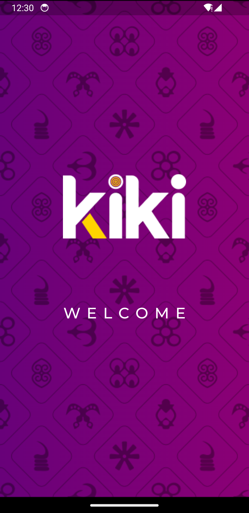
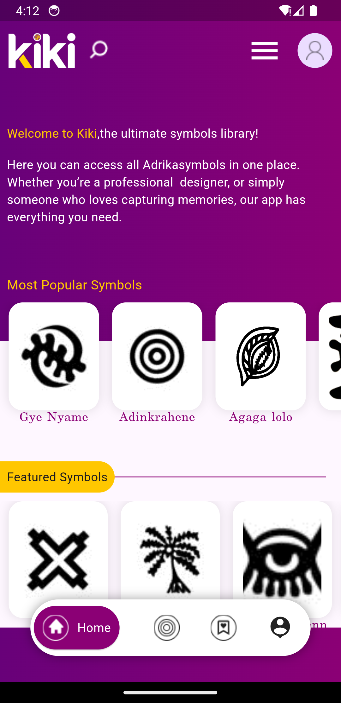
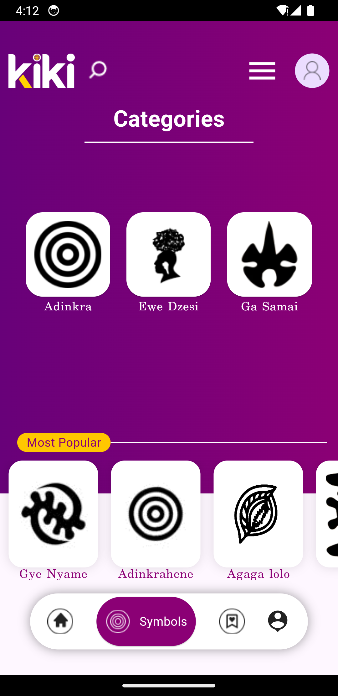

# KIKI

A new Flutter project.

## Getting Started

An a mobile app that contains all the Ghanaian Symbols and their various meanings.

 Flutter version used is 3.19.6

<table>
    <tr>
        <td></td>
        <td></td>
        <td></td>
    </tr>
    <tr>
        <td></td>
        <td></td>
        <td></td>
    </tr>
    <tr>
        <td></td>
        <td></td>
        <td></td>
    </tr>
</table>
